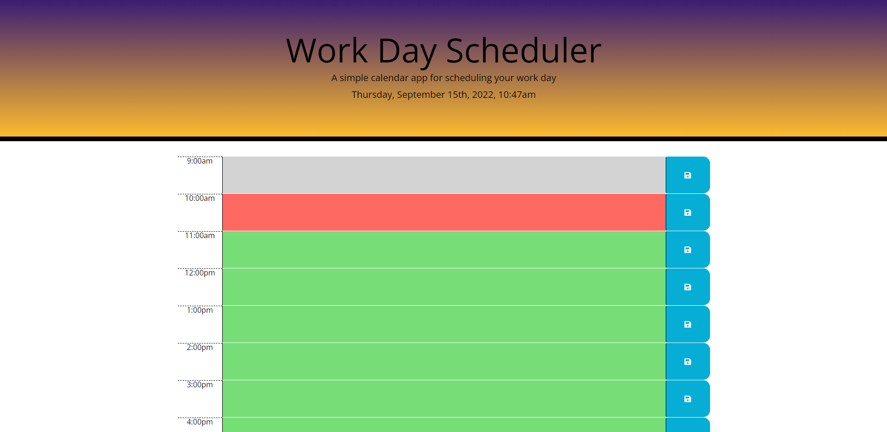

# Work-Day-Planner

## Description

I created a workday planner that provides the ability to write and save daily events in order to plan and organize one's work schedule and day. The scheduler features color coded time blocks so it is easy to tell in which part of the day one is currently in. Once the created events are saved, the page can be refreshed leaving the contents of the page in tact.

[Deployed Site](https://angi-adema.github.io/Work-Day-Planner/)

## Acceptance Criteria

GIVEN I am using a daily planner to create a schedule
WHEN I open the planner
THEN the current day is displayed at the top of the calendar
WHEN I scroll down
THEN I am presented with timeblocks for standard business hours
WHEN I view the timeblocks for that day
THEN each timeblock is color coded to indicate whether it is in the past, present, or future
WHEN I click into a timeblock
THEN I can enter an event
WHEN I click the save button for that timeblock
THEN the text for that event is saved in local storage
WHEN I refresh the page
THEN the saved events persist

## Technologies

HTML
CSS
